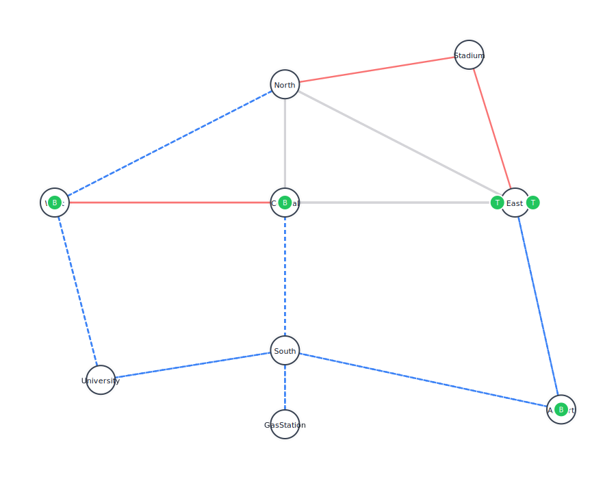

# 🚍 Spade_PublicTransportation: Decentralized Smart City Mobility

[](https://www.python.org/)
[](https://pypi.org/project/spade/)
[](https://networkx.org/)
[](LICENSE)

## 🎯 Project Overview
**Spade_PublicTransportation** is a decentralized simulation of an urban public transportation system. Unlike traditional centralized schedulers, this project utilizes **Agent-Oriented Programming (AOP)** where every entity, station, vehicle, passenger, and traffic light, is an autonomous agent.

The system solves the **Dynamic Vehicle Routing Problem (DVRP)** using the **Contract Net Protocol (CNP)**. Vehicles bid for passengers based on their current location, fuel status, and route constraints, creating a self-organizing logistics network that adapts to breakdowns and traffic jams in real-time.

---

## ⚡ Key Architectural Features
The simulation runs on a custom **XMPP-based** infrastructure where agents communicate asynchronously.

| Agent Type | Responsibilities & Behavior |
| :--- | :--- |
| **🏢 Station** | Detecting passengers, initiating **CNP Auctions**, and broadcasting demand surges to nearby vehicles. |
| **🚍 Vehicle** | Autonomous navigation using **Dijkstra’s Algorithm**. Manages fuel, handles breakdowns, and bids on ride requests based on calculated ETA. |
| **🚥 Traffic Manager** | Simulates stochastic city conditions by dynamically altering edge weights (traffic jams) to force route recalculations. |
| **🧍 Passenger** | Acts as the system load. Has "patience" logic; if a ride isn't found within a timeout, they cancel the request (simulating lost revenue). |
| **🖥️ Dashboard** | A "Digital Twin" agent that aggregates system state and renders a **Live SVG Map** and HTML status board. |

---

## 🔬 Technical Deep Dive

### 1. The Contract Net Protocol (CNP)
I implemented a FIPA-compliant negotiation protocol to handle ride requests:
1.  **CFP (Call for Proposal):** Station broadcasts a request (`origin` -> `dest`).
2.  **Propose:** Vehicles calculate the cost (Fuel + Time + Traffic) and send a bid.
    * *Constraint:* Trams reject bids requiring non-track routes.
    * *Constraint:* Low-fuel buses reject long-distance bids.
3.  **Accept:** Station selects the vehicle with the lowest ETA.

### 2. Graph-Based Navigation (NetworkX)
The city is modeled as a directed graph with heterogeneous edge types.
* **Multi-Modal Constraints:** The pathfinding algorithm filters edges based on vehicle capability. A bus cannot drive on tram-only tracks, and trams cannot drive on the highway.
* **Dynamic Weighting:** The `TrafficManager` agent updates edge weights randomly. Vehicles listen for `inform` messages regarding traffic and re-run Dijkstra's algorithm mid-trip.

### 3. Finite State Machine Logic
Vehicles operate on a strict lifecycle:
`Idle` → `Negotiating` → `Moving` → `(Event: Breakdown?)` → `Maintenance` → `Refueling` → `Idle`.

---

## 📊 Visualization & Metrics
The system generates a real-time dashboard (`dashboard.html`) and post-simulation analytics (`metrics.csv`).

| Real-Time Dashboard | Performance Analytics |
| :--- | :--- |
|  | **Metric Analysis:** <br>• **Wait Times:** Histogram of passenger wait duration.<br>• **Fleet Utilization:** Time-series data of active vs. idle vehicles.<br>• **Reliability:** Pie chart of Completed Trips vs. Timeout/Cancellations. |

*> Note: The dashboard updates dynamically every 2 seconds via the Dashboard Agent.*

---

## 🛠️ Installation & Usage

### 1. Prerequisites
You need an XMPP server (e.g., ejabberd or Prosody) or use a public server like `jabb.im`.

### 2. Setup
```bash
git clone [https://github.com/Pedrooamaroo/Spade_PublicTransportation.git](https://github.com/Pedrooamaroo/Spade_PublicTransportation.git)
cd Spade_PublicTransportation
pip install -r requirements.txt
´´´

### 3. Configuration
Before running the simulation, you must configure your XMPP credentials.
1. Create a `.env` file in the root directory.
2. Add the following variables:
   ```env
   XMPP_SERVER=jabb.im
   XMPP_PREFIX=your_username
   XMPP_PASSWORD=your_password
   ```
